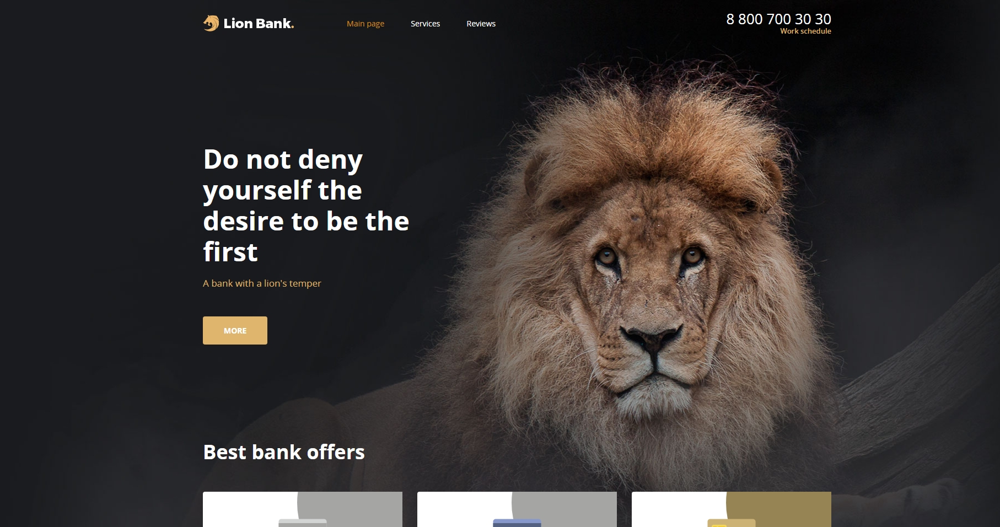

<H1>Lion Bank.</H1>
Проект "Lion Bank" был реализован в качестве выпускного проекта по курсу Loft-School "Основы верстки сайтов".
<ul>Изученый материал по курсу:
<li>1. Редактор кода VSCode</li>
<li>2. Работа с Github</li>
<li>3. Знакомсво с Figma</li>
<li>4. HTML и БЭМ</li>
<li>5. CSS</li>
 </ul>
</img>
